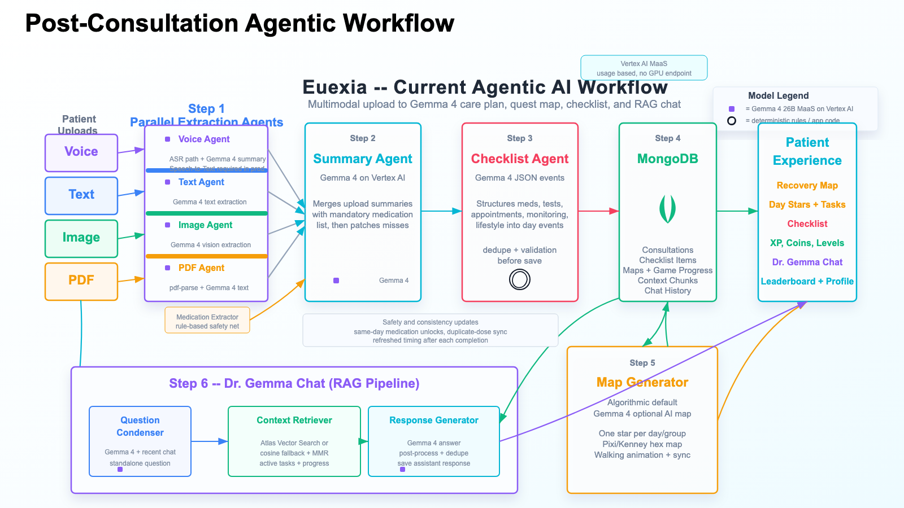

# Euexia

**Euexia is a Gemma 4 powered post-consultation care companion that turns doctor instructions into a personalized recovery journey.**

Patients often leave a clinic with medication instructions, lab tests, follow-up appointments, lifestyle advice, and warning signs, but the plan quickly becomes hard to remember and even harder to follow. Euexia converts that static post-visit information into scheduled tasks, a recovery map, progress rewards, and a grounded follow-up chat assistant.

This repository is our submission for the [Kaggle Gemma 4 Good Hackathon](https://www.kaggle.com/competitions/gemma-4-good-hackathon).

**Demo Video:** [Watch on YouTube](https://youtu.be/ACpz54pgdy8)  
**Project Report:** [Euexia: A Gemma 4 Post-Consultation Care Companion](docs/euexia_gemma4_post_consultation_care_companion.pdf)  
**Agentic Workflow:** [PNG](docs/euexia_updated_agentic_workflow.png) | [SVG](docs/euexia_updated_agentic_workflow.svg)



## Keywords

Gemma 4, Google Vertex AI, Vertex AI MaaS, Model Garden, Google Cloud, Kaggle Gemma 4 Good Hackathon, healthcare AI, health tech, post-consultation care, discharge instructions, patient adherence, medication adherence, gamification, agentic workflow, multimodal AI, RAG, retrieval augmented generation, MongoDB, vector retrieval, Next.js, React, TypeScript, Express, Node.js, PixiJS, mobile-first product design.

## The Problem

The failure point after a consultation is often continuity, not medical knowledge. Patients are expected to remember complex care plans and execute them alone, while dealing with stress, information overload, and unfamiliar medical language.

Euexia targets the fragile moment after the doctor gives the plan and before the patient loses the thread. It helps transform instructions into concrete daily actions without replacing clinicians, diagnosing conditions, or inventing treatment plans.

## What Euexia Does

Euexia accepts consultation material as text, PDF, and medical document images. The backend extracts clinical details, summarizes them into a care plan, turns the plan into scheduled checklist events, stores the result, and renders the journey as a mobile-first game map.

Core product features:

- Multimodal consultation upload for text, PDF, and image inputs
- Gemma 4 powered extraction, summarization, checklist generation, and chat
- Rule-based medication extraction as a safety net for medication completeness
- JSON validation, task normalization, deduplication, and schedule repair
- Day-based recovery map with checkpoints, characters, XP, coins, and streaks
- Checklist and map progress synchronized through MongoDB
- Dr. Gemma chat assistant grounded in the user's saved consultation and checklist
- Mobile-first UI with a desktop mobile viewer for demo and testing

## Agentic AI Workflow

The backend is organized as a hybrid agentic pipeline:

1. Upload agents process text, PDF, and image inputs in parallel.
2. A summary agent merges extracted details into one care-plan paragraph.
3. A rule-based medication extractor catches medication names deterministically.
4. A checklist agent converts the care plan into scheduled JSON events.
5. Validators repair malformed JSON, deduplicate tasks, normalize categories, and check medication completeness.
6. A map generator converts task groups into day-based game checkpoints.
7. A RAG pipeline retrieves consultation summaries, checklist items, and recent context for Dr. Gemma chat.

This design keeps Gemma 4 at the center of the reasoning workflow while using deterministic guardrails for safety-critical structure.

## Why Gemma 4

Euexia is not a generic chatbot. It needs multimodal clinical document understanding, structured JSON generation, long-context care-plan extraction, and grounded follow-up support. Gemma 4 on Vertex AI Model-as-a-Service gives the project a usage-based model path without managing GPU hosting.

In the project report, we compare Gemma 4 with GPT-5.4 mini on the same UH Bristol discharge summary sample. Both captured all expected medications across runs, but Gemma 4 produced more compact, app-ready checklist outputs with lower latency and lower estimated cost. For Euexia, concise and usable tasks matter more than verbose output.

## Technical Architecture

**Frontend**

- Next.js 15, React 19, TypeScript
- Tailwind CSS for the mobile-first interface
- PixiJS for the recovery map experience
- Zustand for local game/checklist state
- Axios API client with JWT authentication

**Backend**

- Node.js, Express, TypeScript
- MongoDB and Mongoose models for users, consultations, checklist items, maps, chat messages, context chunks, and game progress
- Google Vertex AI OpenAI-compatible chat completions endpoint for Gemma 4
- PDF parsing, multimodal upload handling, agent orchestration, task scheduling, gamification, and RAG retrieval

**AI and Retrieval**

- Gemma 4 on Google Vertex AI MaaS
- Local mock mode for fast development
- MongoDB-backed context chunks
- Atlas Vector Search when configured, with in-memory cosine fallback
- MMR reranking and text-level deduplication for grounded chat context

## Repository Map

```text
backend/
  src/controllers/       API controllers for auth, upload, checklist, game, chat
  src/models/            MongoDB models
  src/services/agents/   Text, PDF, image, summary, checklist, medication agents
  src/services/rag/      Context indexing, retrieval, question condensation
  src/services/mapSpec/  Recovery map specification generation
  src/services/googleGemma.ts

frontend/
  src/app/               Next.js routes
  src/components/game/   Map canvas, checkpoints, overlays, character movement
  src/components/upload/ Upload inputs for notes, PDFs, images, voice UI
  src/components/chat/   Dr. Gemma assistant modal
  src/stores/            Game/checklist state synchronization

docs/
  euexia_gemma4_post_consultation_care_companion.pdf
  euexia_updated_agentic_workflow.png
  euexia_updated_agentic_workflow.svg
```

## Local Development

Create local environment files outside git. Do not commit real secrets.

Backend `.env` example:

```env
PORT=8080
MONGODB_URI=<your-mongodb-uri>
JWT_SECRET=<your-local-jwt-secret>
GOOGLE_CLOUD_PROJECT=<your-google-cloud-project>
GOOGLE_VERTEX_LOCATION=global
GOOGLE_VERTEX_MODEL=gemma-4-26b-a4b-it-maas
USE_MOCK_AGENTS=false
FRONTEND_URL=http://localhost:3000
```

Frontend `.env.local` example:

```env
NEXT_PUBLIC_API_URL=http://localhost:8080/api
```

Run the backend:

```bash
cd backend
npm install
npm run dev
```

Run the frontend:

```bash
cd frontend
npm install
npm run dev
```

Open:

```text
http://localhost:3000
```

## Vertex AI Setup

Authenticate locally:

```bash
gcloud auth application-default login
gcloud config set project <your-google-cloud-project>
```

Enable Vertex AI and Gemma 4 MaaS access from Google Cloud Console:

```text
Vertex AI -> Model Garden -> Gemma 4 26B A4B IT -> Enable API Service / MaaS
```

The app uses the OpenAI-compatible Vertex chat-completions endpoint through:

```text
backend/src/services/googleGemma.ts
```

## Verification

Build both apps:

```bash
cd backend
npm run build

cd ../frontend
npm run build
```

Smoke test Gemma 4 from the backend:

```bash
cd backend
GOOGLE_CLOUD_PROJECT=<your-google-cloud-project> \
GOOGLE_VERTEX_LOCATION=global \
GOOGLE_VERTEX_MODEL=gemma-4-26b-a4b-it-maas \
USE_MOCK_AGENTS=false \
npm run test:gemma-custom -- "Say hello from Gemma 4 in one sentence."
```

## Skills Demonstrated

- Product storytelling for a health AI use case
- Multimodal AI system design with Gemma 4
- Agentic workflow orchestration in a production-style backend
- Structured JSON generation and validation for user-facing workflows
- Medication-focused safety guardrails and deterministic post-processing
- RAG design with chunking, retrieval, MMR reranking, and fallback search
- Full-stack TypeScript development across Next.js and Express
- MongoDB schema design for consultations, tasks, maps, chat, and game state
- Mobile-first UI design, gamification, animation, and frontend state sync
- Google Cloud and Vertex AI MaaS integration

## Medical Safety Note

Euexia is a hackathon proof-of-concept. It is designed to help patients understand and follow clinician-provided instructions, not to diagnose, prescribe, or replace medical judgment. Any real deployment would require clinical validation, privacy review, safety evaluation, and provider workflow integration.
